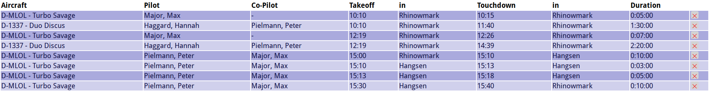

# Airbatch

Flight Data Recognition Framework

## About


Aircraft movement has to be recorded for several reasons, mostly for legal regulations but also for billing. Especially smaller airfields like clubs for soaring or microlight aircraft don't have fully fledged, GPS-aided tracking and flight recording facilities.

In most cases, a "starting list" recording all flight movements is done by hand, or with the support of a (in many cases terrible) computer software providing a static table where flights are entered, sometimes also by weird input masks. 

This is where Airbatch comes it. Instead of an input mask or table to record any flights, it offers just a text input, where aircrafts, pilots, takeoff- and touchdown-times and takeoff- and touchdown-locations can be specified in a simple but innovative style.

All data is provided via tokens to identify aircraft, pilot, times, durations and locations. A context-dependent logic is then used to construct valid flight data from these tokens. If a token cannot be directly processed, it is put on a clarify-line to be processed later on. Therefore, input for Airbatch cannot directly be expressed as a context-free grammar.

**Note:** Airbatch is highly experimental and under an ongoing development process. It can also be used as a base for other projects where any table-like recording of objects, persons, time and other things is required.

## Example

Let there be small, fictive soaring club at Rhinowmark, having three members called "Max Major", "Hannah Haggard" and "Peter 'Puddy' Pielman". They have two aircraft, a glider Schempp-Hirth Duo Discus *D-1337 YX* and a microlight aicraft Zlin Turbo Savage *D-MLOL*, which can also be used for glider tow launching.

Hannah and Peter are doing two tow launches of the glider, with Max as tow pilot. Later on, Peter and Max are flying over to Hangsen airfield, make two touch-and-go there, land for a short coffee time and fly back again to Rhinowmark.

They perform the following flights:



This list can be generated by this very straightforward text input form:

```
D-MLOL Major, Max  1010 Rhinowmark 1015 Rhinowmark
D-1337 Haggard, Hannah   Pielmann, Peter 1010 Rhinowmark 1140 Rhinowmark
D-MLOL Major, Max  1219 Rhinowmark 1226 Rhinowmark
D-1337 Haggard, Hannah   Pielmann, Peter 1219 Rhinowmark 1439 Rhinowmark
D-MLOL Pielmann, Peter   Major, Max 1500 Rhinowmark 1510 Hangsen
D-MLOL Pielmann, Peter   Major, Max 1510 Hangsen 1513 Hangsen
D-MLOL Pielmann, Peter   Major, Max 1513 Hangsen 1518 Hangsen
D-MLOL Pielmann, Peter   Major, Max 1530 Hangsen 1540 Rhinowmark
```

But also using this extremely short input form, where only durations are added.
```
OL major YX hagg puddy 1010 +5 +1:30
1219 +7 +2:20

OL puddy major 1500 1510 Hangsen
+3 +5
1530 Hangsen 1540
```

It's on yours how you feed Airbatch!

## License

This software is Copyright (C) 2018, 2019 by Jan Max Meyer, Phorward Software Technologies.

It is licensed under the GNU AFFERO GENERAL PUBLIC LICENSE.

## Contact

Contact @phorward for help and support.


